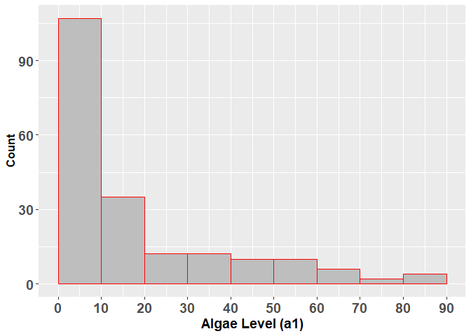
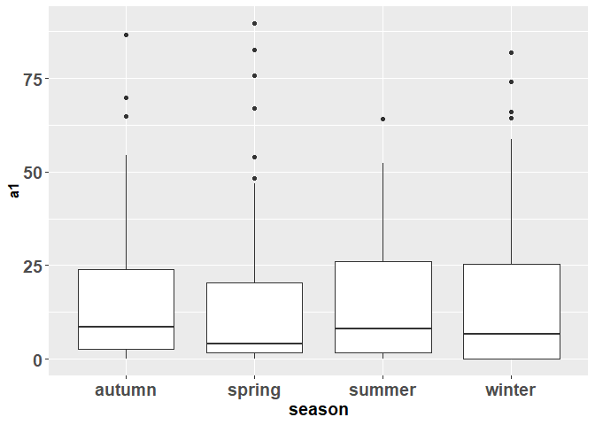
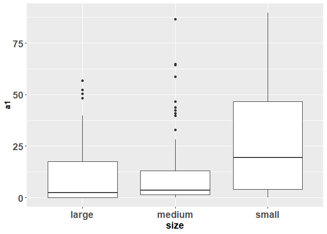
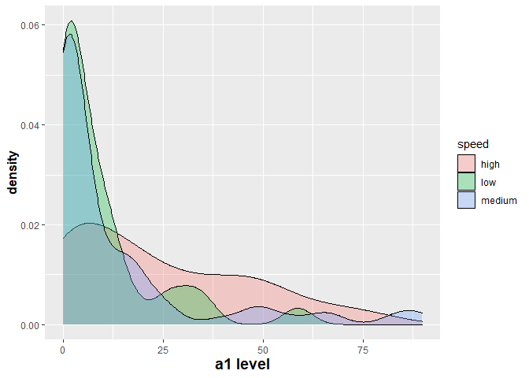
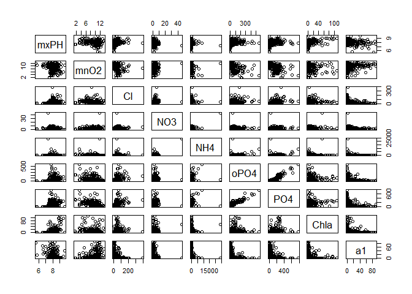
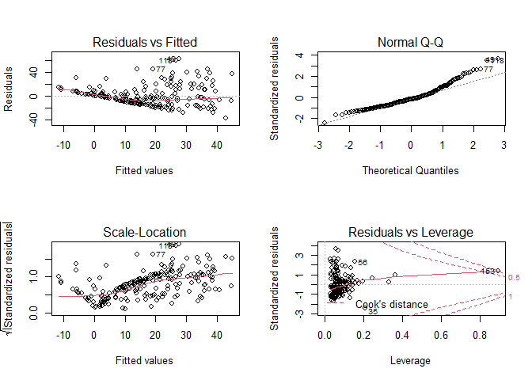
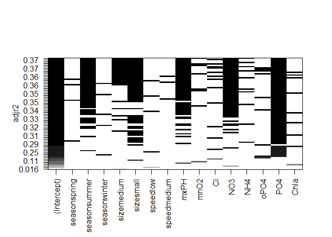
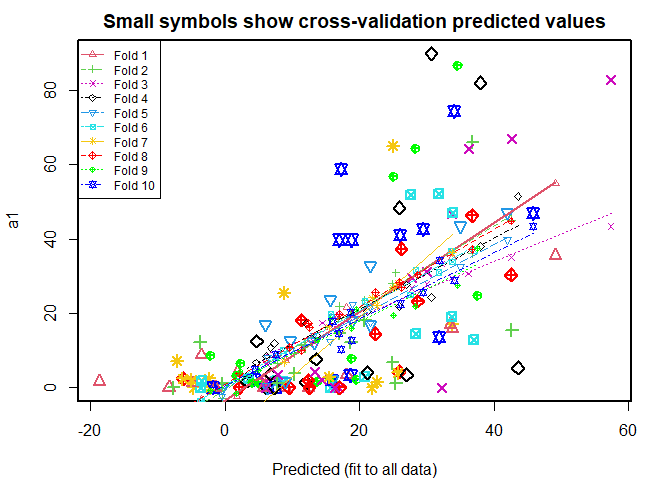
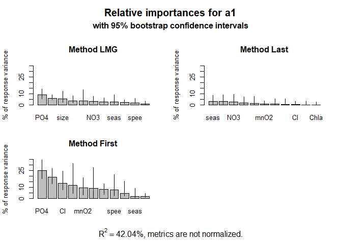

<b> Introduction </b> In this article, I explain and demonstrate a few basic principles of machine learning (I call it "Tier 1" of Machine Learning) using the programming language R and the algae data set included in the R code package, DMwR. The variable to be predicted through the model (also called "target variable" or "response variable") is the algae level,  a1.  The other set of variables used in the model are called the "predictor variables" (also called "feature variables", that is, features in the data) that will be part of the mathematical model or function that will predict the Target Variable. 

There are three major steps in machine learning: 

<b> Step 1. Data Clean-up </b> This step helps to clean-up irregular and missing values in the data set before conducting further analysis

<b> Step 2. Exploratory Data Analysis </b> Exploring variables of interest in the data set through visualization tools so as to form initial impression of the data set

<b> Step 3: Mathematical Model (Machine Learning Model) setup </b> 
There are two subsets within this step.  
<i>Step 3.1. Variable Selection Step.</i> Since there are many variables in the data, it is not possible to include all of them in the mathematical model.It is necessary to get a list of the most important variable that can then be used to form the model. This step is called "variable selection" step. One way is to make a linear regression model. There are few other methods you could use for variable selection step - bootstrapping, cross validation, stepwise and subset regression. These concepts are discussed in more detail below.  
<i>Step 3.2.</i> Construction of predictive modeling.

This article's focus will be on Steps 1 to 3.1. I will post another article to focus on Step 3.2 since it a big topic.

# How to set up the data and code packages in R?

As mentioned above, code package not only contain useful code fragments made available but also contains datasets within them. 
As stated above, DMwE package contains algae data set. The below code fragment shows how to install and attach the package to your R environment.


```r
# install.packages('DMwR', dependencies=TRUE)
library(DMwR)
```
There are additional packages such as lattice, grids etc. that will get installed alongside DMwR

## Step 1. Clean-up dataset

*** The goal of this step is to conduct Summary of dataset to expose NA and other irregular characters in the data set ***

The following str() command displays the data types (numerical/float, integer, categorical, string etc.) of variables well. 
'data.frame' is a special matrix or a table that can contain different data types together.
The data set consists of 3 categorical variables (also called the "factor" data type in R - season, size, speed) and 15 numerical variables.


```r
str(algae)
```

```
'data.frame':	200 obs. of  18 variables:
 $ season: Factor w/ 4 levels "autumn","spring",..: 4 2 1 2 1 4 3 1 4 4 ...
 $ size  : Factor w/ 3 levels "large","medium",..: 3 3 3 3 3 3 3 3 3 3 ...
 $ speed : Factor w/ 3 levels "high","low","medium": 3 3 3 3 3 1 1 1 3 1 ...
 $ mxPH  : num  8 8.35 8.1 8.07 8.06 8.25 8.15 8.05 8.7 7.93 ...
 $ mnO2  : num  9.8 8 11.4 4.8 9 13.1 10.3 10.6 3.4 9.9 ...
 $ Cl    : num  60.8 57.8 40 77.4 55.4 ...
 $ NO3   : num  6.24 1.29 5.33 2.3 10.42 ...
 $ NH4   : num  578 370 346.7 98.2 233.7 ...
 $ oPO4  : num  105 428.8 125.7 61.2 58.2 ...
 $ PO4   : num  170 558.8 187.1 138.7 97.6 ...
 $ Chla  : num  50 1.3 15.6 1.4 10.5 ...
 $ a1    : num  0 1.4 3.3 3.1 9.2 15.1 2.4 18.2 25.4 17 ...
 $ a2    : num  0 7.6 53.6 41 2.9 14.6 1.2 1.6 5.4 0 ...
 $ a3    : num  0 4.8 1.9 18.9 7.5 1.4 3.2 0 2.5 0 ...
 $ a4    : num  0 1.9 0 0 0 0 3.9 0 0 2.9 ...
 $ a5    : num  34.2 6.7 0 1.4 7.5 22.5 5.8 5.5 0 0 ...
 $ a6    : num  8.3 0 0 0 4.1 12.6 6.8 8.7 0 0 ...
 $ a7    : num  0 2.1 9.7 1.4 1 2.9 0 0 0 1.7 ...
```


```r
# The following command will effectively summarize the data range.  As can be
# seen, there are a few missing values indicated by 'Not Available (NA)' in the
# data
summary(algae)
```

```
    season       size       speed         mxPH            mnO2       
 autumn:40   large :45   high  :84   Min.   :5.600   Min.   : 1.500  
 spring:53   medium:84   low   :33   1st Qu.:7.700   1st Qu.: 7.725  
 summer:45   small :71   medium:83   Median :8.060   Median : 9.800  
 winter:62                           Mean   :8.012   Mean   : 9.118  
                                     3rd Qu.:8.400   3rd Qu.:10.800  
                                     Max.   :9.700   Max.   :13.400  
                                     NA's   :1       NA's   :2       
       Cl               NO3              NH4                oPO4       
 Min.   :  0.222   Min.   : 0.050   Min.   :    5.00   Min.   :  1.00  
 1st Qu.: 10.981   1st Qu.: 1.296   1st Qu.:   38.33   1st Qu.: 15.70  
 Median : 32.730   Median : 2.675   Median :  103.17   Median : 40.15  
 Mean   : 43.636   Mean   : 3.282   Mean   :  501.30   Mean   : 73.59  
 3rd Qu.: 57.824   3rd Qu.: 4.446   3rd Qu.:  226.95   3rd Qu.: 99.33  
 Max.   :391.500   Max.   :45.650   Max.   :24064.00   Max.   :564.60  
 NA's   :10        NA's   :2        NA's   :2          NA's   :2       
      PO4              Chla               a1              a2        
 Min.   :  1.00   Min.   :  0.200   Min.   : 0.00   Min.   : 0.000  
 1st Qu.: 41.38   1st Qu.:  2.000   1st Qu.: 1.50   1st Qu.: 0.000  
 Median :103.29   Median :  5.475   Median : 6.95   Median : 3.000  
 Mean   :137.88   Mean   : 13.971   Mean   :16.92   Mean   : 7.458  
 3rd Qu.:213.75   3rd Qu.: 18.308   3rd Qu.:24.80   3rd Qu.:11.375  
 Max.   :771.60   Max.   :110.456   Max.   :89.80   Max.   :72.600  
 NA's   :2        NA's   :12                                        
       a3               a4               a5               a6        
 Min.   : 0.000   Min.   : 0.000   Min.   : 0.000   Min.   : 0.000  
 1st Qu.: 0.000   1st Qu.: 0.000   1st Qu.: 0.000   1st Qu.: 0.000  
 Median : 1.550   Median : 0.000   Median : 1.900   Median : 0.000  
 Mean   : 4.309   Mean   : 1.992   Mean   : 5.064   Mean   : 5.964  
 3rd Qu.: 4.925   3rd Qu.: 2.400   3rd Qu.: 7.500   3rd Qu.: 6.925  
 Max.   :42.800   Max.   :44.600   Max.   :44.400   Max.   :77.600  
                                                                    
       a7        
 Min.   : 0.000  
 1st Qu.: 0.000  
 Median : 1.000  
 Mean   : 2.495  
 3rd Qu.: 2.400  
 Max.   :31.600  
                 
```

Now that missing values (NAs) have been located in the dataset, it is time to address them because it will hinder model estimation  
<b> Step# 1.1: Remove observations in the data that have "many" missing values </b>  
In this example, I set the criterion for "many" to be >=20% values to be missing values)  
<b> Step# 1.2:  Impute potential values for the missing values from 'neighboring' observations </b>  
'Neighboring' observation to a given observation is defined in terms of their numerical correlations.

Step 1.1: Removing observations with too "many" missing values.   
I define them as "non-ideal.observations".manyNAs is a function in the DMwR code package that helps to identify the non-ideal observations, observations that have 20% or more # values to be missing. The function accepts algae (the dataset/dataframe) as input and 20% is encoded as 0.2 in the formula of the manyNAs function.manyNAs output the row numbers/IDs of "non-ideal.observations" in the dataframe.

```r
# Displays a list of non-ideal observations
manyNAs(algae, 0.2)
```

```
[1]  62 199
```

```r
# These non-ideal observations are then removed from the dataframe
algae.clean = algae[-(manyNAs(algae, 0.2)), ]
```

Step 1.2: Imputation  
There are different type of imputation. The type I use here is called K Nearest Neighbor Imputation (KNN Imputation).   
KNN Imputation fills in the missing values by drawing on values of the K 'nearest neighbors' defined above. K is a value supplied by the user denoting the number of nearest neighbors to be used for missing value inference. For example, k=5, 10 etc.   
This process in R is accomplished by a function named "knnImputation". meth describes the kind of method used for inference. In this example, the method of choice is median and k=10.  
In other words, for every missing value, this method will choose the 10 nearest observations and the missing value would be estimated as their median values. The cleaned up data is stored in a new dataframe object named 'algae.clean.2' 

```r
# Imputing to infer missing values
algae.clean.2 = knnImputation(algae.clean, k = 10, meth = "median")
```

Now that missing value issue has been addressed using knnImputation, we can confirm it through using summary function if NA values have been replaced

```r
# Checking for missing observations
summary(algae.clean.2)
```

```
    season       size       speed         mxPH            mnO2       
 autumn:40   large :44   high  :84   Min.   :5.600   Min.   : 1.500  
 spring:53   medium:84   low   :33   1st Qu.:7.705   1st Qu.: 7.825  
 summer:44   small :70   medium:81   Median :8.060   Median : 9.800  
 winter:61                           Mean   :8.019   Mean   : 9.135  
                                     3rd Qu.:8.400   3rd Qu.:10.800  
                                     Max.   :9.700   Max.   :13.400  
       Cl               NO3              NH4                oPO4       
 Min.   :  0.222   Min.   : 0.050   Min.   :    5.00   Min.   :  1.00  
 1st Qu.: 10.425   1st Qu.: 1.296   1st Qu.:   38.33   1st Qu.: 15.70  
 Median : 32.178   Median : 2.675   Median :  103.17   Median : 40.15  
 Mean   : 42.434   Mean   : 3.282   Mean   :  501.30   Mean   : 73.59  
 3rd Qu.: 57.492   3rd Qu.: 4.446   3rd Qu.:  226.95   3rd Qu.: 99.33  
 Max.   :391.500   Max.   :45.650   Max.   :24064.00   Max.   :564.60  
      PO4              Chla               a1               a2        
 Min.   :  1.00   Min.   :  0.200   Min.   : 0.000   Min.   : 0.000  
 1st Qu.: 41.38   1st Qu.:  2.000   1st Qu.: 1.525   1st Qu.: 0.000  
 Median :103.29   Median :  5.155   Median : 6.950   Median : 3.000  
 Mean   :137.88   Mean   : 13.355   Mean   :16.996   Mean   : 7.471  
 3rd Qu.:213.75   3rd Qu.: 17.200   3rd Qu.:24.800   3rd Qu.:11.275  
 Max.   :771.60   Max.   :110.456   Max.   :89.800   Max.   :72.600  
       a3               a4               a5               a6        
 Min.   : 0.000   Min.   : 0.000   Min.   : 0.000   Min.   : 0.000  
 1st Qu.: 0.000   1st Qu.: 0.000   1st Qu.: 0.000   1st Qu.: 0.000  
 Median : 1.550   Median : 0.000   Median : 2.000   Median : 0.000  
 Mean   : 4.334   Mean   : 1.997   Mean   : 5.116   Mean   : 6.005  
 3rd Qu.: 4.975   3rd Qu.: 2.400   3rd Qu.: 7.500   3rd Qu.: 6.975  
 Max.   :42.800   Max.   :44.600   Max.   :44.400   Max.   :77.600  
       a7        
 Min.   : 0.000  
 1st Qu.: 0.000  
 Median : 1.000  
 Mean   : 2.487  
 3rd Qu.: 2.400  
 Max.   :31.600  
```

```r
# yup, solved.
```

***************************************** End of Step 1. Clean-up dataset ***********************************************

## Step 2. Exploratory Data Analysis (EDA)
Since the data has been cleaned-up, we can now conduct some preliminary exploratory data analysis to understand the relationships between variables in the data set. 

The plot below shows that, of the 200 observations, slightly over 50% observations have target variable,a1 level, is between 0-10 while the remaining observations' a1 levels are spread between 10-100

```r
# Histogram (a1 levels).
library(ggplot2)
ggplot(algae.clean.2, aes(x = a1)) + geom_histogram(binwidth = 10, fill = "grey", 
    color = "red", boundary = 0) + scale_x_continuous(name = "Algae Level (a1)", 
    breaks = seq(0, 100, 10)) + scale_y_continuous(name = "Count") + theme(axis.text.x = element_text(size = 14, 
    face = "bold"), axis.text.y = element_text(size = 14, face = "bold"), axis.title.x = element_text(size = 14, 
    face = "bold"), axis.title.y = element_text(size = 12, face = "bold"))
```

<!-- -->


It appears the variable "size" has a stronger influence on the al level than "season". 

```r
par(mfrow = c(1, 2))  # partition the plot area to accomodate two images

# Effect of season over a1 levels
ggplot(algae.clean.2, aes(x = season, y = a1)) + geom_boxplot() + theme(axis.text.x = element_text(size = 14, 
    face = "bold"), axis.text.y = element_text(size = 14, face = "bold"), axis.title.x = element_text(size = 14, 
    face = "bold"), axis.title.y = element_text(size = 12, face = "bold"))
```

<!-- -->

```r
# Effect of size over a1 levels
ggplot(algae.clean.2, aes(x = size, y = a1)) + geom_boxplot() + theme(axis.text.x = element_text(size = 14, 
    face = "bold"), axis.text.y = element_text(size = 14, face = "bold"), axis.title.x = element_text(size = 14, 
    face = "bold"), axis.title.y = element_text(size = 12, face = "bold"))
```

<!-- -->


It also appears that the speed may not have strong influence on the a1 level

```r
# Density plot
ggplot(algae.clean.2, aes(x = a1, fill = speed)) + geom_density(alpha = 0.3) + scale_x_continuous(name = "a1 level") + 
    theme(axis.title.x = element_text(size = 14, face = "bold"), axis.title.y = element_text(size = 12, 
        face = "bold"))
```

<!-- -->


Scatter plot is a good way to quickly scan variable relationship among numerical variables.  
It appears from the scatterplot below:  
1. mnO2 seems to have a positive relationship with a1.  
2. OPO4, PO4 and Chla: each have an inverse relationship with a1 

```r
library(gcookbook)
pairs(algae.clean.2[, 4:12])
```

<!-- -->

**************************************** End of Step 2. EDA **********************************************************************8

## Step 3.1. Variable Selection Step

As described in the introduction, one of the key steps towards variable selection is to generate a linear regression model based on the variables.  

Notes about algae dataset:
1. The first 11 columns of the object represent the predictor/feature variables such as season, size, speed, mxPH, mnO2, Cl, NO3, NH4, OPO4, PO4 and chla
2. The 12th column represents the target variable, algae level a1. 
3. In other words, the goal is to predict algae level based on environmental factors and chemical concentrations.


```r
# lm is the linear model function formula is the formula of the linear model
# expressed in the following format: 'target variable ~ function (predictor
# variable) In the case of formula = 'target variable ~ . ', '.' means all the
# available predictor variables.  algae.lm1 represents the object that contains
# information about the linear model

algae.lm1 = lm(a1 ~ ., data = algae.clean.2[, 1:12])
```

How to extract information about the linear model object, algae.lm1?  
1. Summary() below gives the coefficients of the various predictor variables in the linear model, their standard errors and significance.  
2. Significance indicates whether the relationship between a given predictor variable and the target variable is significantly correlated.  
3. The summary also provides the value of estimated adjusted regression coefficient which is useful to know how much of the data is explained by the model. 
4. Variable significance is indicated by * (p-value<0.05) or ** (p-value<0.01) or *** (p-value <0.001);   
5. p-value was arrived at based on t-value = Estimate/Std.Error) and we can see that a few variables such as size(small) and No3 significantly contribute to the mathematical model. This step of variable selection, therefore, helps to identify these significant variables that can then be used to construct the machine learning mathematical model in Step 3.2

```r
# Model information contained in the model object algae.lm1 can be extracted in the following way:
summary(algae.lm1)
```

```
## 
## Call:
## lm(formula = a1 ~ ., data = algae.clean.2[, 1:12])
## 
## Residuals:
##     Min      1Q  Median      3Q     Max 
## -37.693 -11.821  -2.672   7.159  62.181 
## 
## Coefficients:
##               Estimate Std. Error t value Pr(>|t|)   
## (Intercept)  41.989160  24.089719   1.743  0.08302 . 
## seasonspring  3.751878   4.132182   0.908  0.36510   
## seasonsummer  0.783123   4.018442   0.195  0.84570   
## seasonwinter  3.713428   3.863198   0.961  0.33771   
## sizemedium    3.283115   3.799908   0.864  0.38873   
## sizesmall     9.687246   4.179069   2.318  0.02156 * 
## speedlow      3.973299   4.704463   0.845  0.39945   
## speedmedium   0.275558   3.240694   0.085  0.93233   
## mxPH         -3.512725   2.715062  -1.294  0.19738   
## mnO2          1.080363   0.704025   1.535  0.12663   
## Cl           -0.040298   0.033665  -1.197  0.23285   
## NO3          -1.513109   0.551199  -2.745  0.00666 **
## NH4           0.001643   0.001003   1.639  0.10301   
## oPO4         -0.006014   0.039892  -0.151  0.88032   
## PO4          -0.051532   0.030783  -1.674  0.09584 . 
## Chla         -0.090460   0.080298  -1.127  0.26141   
## ---
## Signif. codes:  0 '***' 0.001 '**' 0.01 '*' 0.05 '.' 0.1 ' ' 1
## 
## Residual standard error: 17.64 on 182 degrees of freedom
## Multiple R-squared:  0.3737,	Adjusted R-squared:  0.3221 
## F-statistic: 7.241 on 15 and 182 DF,  p-value: 2.265e-12
```

Additional thoughts:
Another useful piece of information that can be analyzed from the model object is the residual data generated from the model. Residual data represents how much the predicted model output of target variable differs from the actual data. Using the residual information, one can infer information such as whether there is normality in the data as well as detecting outlier observations in the dataset.

```r
par(mfrow = c(2, 2))  # this command creates a 2 by 2 spread for the four output images generated by the next plot command 
plot(algae.lm1)
```

<!-- -->

Of these four, the 2 plots - **Normal Q-Q plot and  Residual v. Leverage plot**, are particularly important.  
1. If the points on the Q-Q normality plot deviates from the dotted line, then the inference is that the residuals do not form a Gaussian/normal distribution and therefore the model (Linear model in the present case) is not a good fit. In the current example, it seems to be non-gaussian for target values (a1 values) on the higher side.  
2. On the other hand, the leverage value of observations in the residual vs leverage plot shows how much leverage the observation has on affecting the model parameter values. In other words, a high leverage value for an observation beyond a certain threshold (called cooks's distance shown by red dotted lines in the graph) indicates an outlier. In the present case, observation # 153 qualifies as an outlier and hence will be removed from the dataset.


```r
algae.clean.2.1 = algae.clean.2[-153,]
```

Now that outliers have been eliminated from data, one of the first things to do is to split data to test data and training data because:  
(i) Training data is used for variable selection and mathematical model development  
(ii) Test data should be purely used for final validation of the generated model to prevent learning bias creeping up inside the model


```r
# I split the data set into train and test data by a 2:1 ratio Since sampling is
# random, set.seed() ensures the same sample is drawn each time
set.seed(0)
train.rows = sample(1:nrow(algae.clean.2.1), size = round(2/3 * nrow(algae.clean.2)), 
    replace = F)  # 2/3 sample is drawn from the data set to form training data

# training and test data sets are assigned
algae.clean.2.1.train = algae.clean.2.1[train.rows, ]
algae.clean.2.1.test = algae.clean.2.1[-train.rows, ]
```

Now having removed the outlier, the linear model function (lm) was executed again and the following was the output

```r
algae.lm2 = lm(formula = a1 ~ ., data = algae.clean.2.1.train[, 1:12])
summary(algae.lm2)
```

```

Call:
lm(formula = a1 ~ ., data = algae.clean.2.1.train[, 1:12])

Residuals:
    Min      1Q  Median      3Q     Max 
-38.265 -12.568  -2.484   8.554  59.128 

Coefficients:
              Estimate Std. Error t value Pr(>|t|)  
(Intercept)  61.320059  32.175760   1.906   0.0592 .
seasonspring  4.739261   5.375749   0.882   0.3798  
seasonsummer -6.659402   5.424532  -1.228   0.2221  
seasonwinter  3.001339   4.865417   0.617   0.5385  
sizemedium   10.328512   4.958128   2.083   0.0394 *
sizesmall    12.369973   5.465821   2.263   0.0255 *
speedlow      6.248268   5.958369   1.049   0.2965  
speedmedium   3.013181   4.230000   0.712   0.4777  
mxPH         -6.392273   3.606923  -1.772   0.0790 .
mnO2          1.338163   0.934962   1.431   0.1550  
Cl           -0.037684   0.041703  -0.904   0.3681  
NO3          -1.638939   0.680950  -2.407   0.0177 *
NH4           0.001445   0.001214   1.190   0.2365  
oPO4          0.026854   0.053809   0.499   0.6187  
PO4          -0.084126   0.043466  -1.935   0.0554 .
Chla         -0.044227   0.097199  -0.455   0.6500  
---
Signif. codes:  0 '***' 0.001 '**' 0.01 '*' 0.05 '.' 0.1 ' ' 1

Residual standard error: 18.28 on 116 degrees of freedom
Multiple R-squared:  0.4204,	Adjusted R-squared:  0.3454 
F-statistic: 5.609 on 15 and 116 DF,  p-value: 1.783e-08
```

Since we now know only a few variables are useful to create the model, a good next step would be to create a <b>backward stepwise regression model </b>. In other words, this is a step-by-step regression model creation process that gradually eliminates weak variables from the variable set leaving behind only the most effective variables to generate a strong model. The below output shows the gradual winnowing out of the weak variables.

```r
algae.step = step(algae.lm2)  # it takes as input a linear model object
```

```
Start:  AIC=782.12
a1 ~ season + size + speed + mxPH + mnO2 + Cl + NO3 + NH4 + oPO4 + 
    PO4 + Chla

         Df Sum of Sq   RSS    AIC
- speed   2    378.68 39153 779.40
- Chla    1     69.20 38844 780.35
- oPO4    1     83.25 38858 780.40
- Cl      1    272.94 39047 781.04
- NH4     1    473.24 39248 781.72
<none>                38774 782.12
- mnO2    1    684.73 39459 782.43
- season  3   2009.33 40784 782.79
- mxPH    1   1049.84 39824 783.64
- PO4     1   1252.11 40026 784.31
- size    2   1978.61 40753 784.69
- NO3     1   1936.34 40711 786.55

Step:  AIC=779.4
a1 ~ season + size + mxPH + mnO2 + Cl + NO3 + NH4 + oPO4 + PO4 + 
    Chla

         Df Sum of Sq   RSS    AIC
- Chla    1     14.72 39168 777.45
- oPO4    1     23.43 39176 777.48
- Cl      1    232.34 39385 778.18
- NH4     1    371.73 39525 778.65
- mnO2    1    520.30 39673 779.14
<none>                39153 779.40
- season  3   2024.88 41178 780.06
- PO4     1    971.05 40124 780.63
- size    2   1605.52 40759 780.71
- mxPH    1   1144.47 40298 781.20
- NO3     1   1807.21 40960 783.36

Step:  AIC=777.45
a1 ~ season + size + mxPH + mnO2 + Cl + NO3 + NH4 + oPO4 + PO4

         Df Sum of Sq   RSS    AIC
- oPO4    1     45.13 39213 775.60
- Cl      1    225.42 39393 776.21
- NH4     1    367.79 39536 776.68
- mnO2    1    522.26 39690 777.20
<none>                39168 777.45
- season  3   2049.57 41217 778.18
- size    2   1670.22 40838 778.96
- PO4     1   1266.55 40434 779.65
- mxPH    1   1429.75 40598 780.18
- NO3     1   1872.50 41040 781.61

Step:  AIC=775.6
a1 ~ season + size + mxPH + mnO2 + Cl + NO3 + NH4 + PO4

         Df Sum of Sq   RSS    AIC
- Cl      1     215.4 39428 774.33
- NH4     1     444.8 39658 775.09
- mnO2    1     583.2 39796 775.55
<none>                39213 775.60
- season  3    2051.9 41265 776.34
- size    2    1628.5 40841 776.97
- mxPH    1    1444.8 40658 778.38
- NO3     1    1987.2 41200 780.13
- PO4     1    4611.8 43825 788.28

Step:  AIC=774.33
a1 ~ season + size + mxPH + mnO2 + NO3 + NH4 + PO4

         Df Sum of Sq   RSS    AIC
- mnO2    1     597.7 40026 774.31
<none>                39428 774.33
- NH4     1     603.9 40032 774.33
- season  3    2004.5 41433 774.87
- size    2    1671.2 41099 775.81
- mxPH    1    1543.2 40971 777.39
- NO3     1    2450.3 41879 780.28
- PO4     1    6483.9 45912 792.42

Step:  AIC=774.31
a1 ~ season + size + mxPH + NO3 + NH4 + PO4

         Df Sum of Sq   RSS    AIC
- NH4     1     325.1 40351 773.38
- season  3    1781.4 41807 774.06
<none>                40026 774.31
- size    2    1872.0 41898 776.34
- mxPH    1    1494.7 41521 777.15
- NO3     1    1914.7 41941 778.48
- PO4     1   11094.7 51121 804.61

Step:  AIC=773.38
a1 ~ season + size + mxPH + NO3 + PO4

         Df Sum of Sq   RSS    AIC
<none>                40351 773.38
- season  3    1924.2 42275 773.53
- size    2    2005.5 42357 775.78
- mxPH    1    1431.6 41783 775.98
- NO3     1    2110.0 42461 778.11
- PO4     1   10772.1 51123 802.61
```
More explanation on the output of **stepwise regression model**:  
1. As you can see this was a step by step approach. The process starts with all variables in the linear model, then each variable is left out while the other variables are retained in the model and this process is conducted for each variable and the resulting models are ordered based on their increasing AIC values.   
2. AIC values are based on the degrees of fit of the data achieved by each model. Among the various models, the model with the lowest AIC value is chosen for the next step as lower the AIC value, the better. 
3. The same process is conducted on the chosen model and this process is carried on till the best model to the next step is same as the starting model at that step. At that point, that last model becomes the optimal linear model and the variables forming that model are the best variables for the model.


```r
# The summary of the final optimal linear model from the above backward stepwise
# regression process is extracted as shown below.
summary(algae.step)
```

```

Call:
lm(formula = a1 ~ season + size + mxPH + NO3 + PO4, data = algae.clean.2.1.train[, 
    1:12])

Residuals:
    Min      1Q  Median      3Q     Max 
-33.527 -12.616  -3.232   9.581  60.166 

Coefficients:
             Estimate Std. Error t value Pr(>|t|)    
(Intercept)  80.92279   28.12080   2.878  0.00472 ** 
seasonspring  0.80292    4.91096   0.163  0.87040    
seasonsummer -9.17132    5.16770  -1.775  0.07841 .  
seasonwinter  0.84036    4.63692   0.181  0.85648    
sizemedium    7.14619    4.23462   1.688  0.09403 .  
sizesmall    12.34125    5.01387   2.461  0.01523 *  
mxPH         -6.89485    3.30054  -2.089  0.03877 *  
NO3          -0.99833    0.39364  -2.536  0.01246 *  
PO4          -0.07452    0.01301  -5.730 7.28e-08 ***
---
Signif. codes:  0 '***' 0.001 '**' 0.01 '*' 0.05 '.' 0.1 ' ' 1

Residual standard error: 18.11 on 123 degrees of freedom
Multiple R-squared:  0.3968,	Adjusted R-squared:  0.3576 
F-statistic: 10.11 on 8 and 123 DF,  p-value: 9.034e-11
```

Based on the summary of stepwise regression, the variables that are most useful/significant in a linear model to predict algae levels are:  
1. size (small)  
2. NO3  
3. PO4


### Subset Modeling
It is also a good idea to arrive at the optimal list of variables for generating a model through another approach called "subset modeling". Program code for subset modeling is included in "Leaps", an R code package. Different combinations/subsets of variables are tested by subset modeling approach and the models are arranged in the order of decreasing adjusted Regression Coefficient (R2) values. Once the models are sorted according to their R2 values, the results are shown visually with a clear indication of variables constituting each model. Based on the R2 values,one can narrow down the optimal subset of variables that can produce the best model.


```r
library(leaps)

# nbest=10 means 10 best combinations of variables are selected for each model
# size (model size = # of variables).
algae.sub = regsubsets(a1 ~ ., data = algae.clean.2.1.train[, 1:12], nbest = 10)

# plotting the results of subset regression modeling
plot(algae.sub, scale = "adjr2")
```

<!-- -->

The result of subset modeling hint that the following variables are optimal for a linear model to predict algae levels:  
1. size (small)  
2. mxPH  
3. mnO2  
4. NO3  
5. PO4  
6. chla


### Cross-Validation 
If you want to avoid over-fitting the model during the training phase, there is a neat approach called "Cross-Validation (CV)". The principle of cross-validation is to randomly divide the data in to "m" more or less equally sized data fragments (The value of m" is chosen by the user. The name of the cross-validation approach is then called M-fold CV). The process uses use m-1 data fragments to train the model and then the trained model is tested on the one remaining data fragment to measure the degree of fit for the model. This process is then repeated by cycling through every data fragment and averaging the degrees of fits of the model across all those fragments. In this way, since the model is subjected to rigorous training, we would avoid over-fitting the model and the true accuracy of the model is measured by averaging the model's performance on the various test data fragments.

Additional programming notes:       
1. CVlm() is the function to carry out linear model cross validation present in the R code package, DAAG  
2. The "form.lm" argument in CVlm() stands for linear model formula  
3. "m" stands for the number of folds of cross validation the user desires.  
4. The output shows the overall ANOVA table displaying significance of the different variables, the observations used in the different test data fragments (also called "folds"), mean sum of square of errors/residuals for each test data fragment and overall performance, that is, average mean sum of square of errors across all the folds.  
5. The CV plot shows how well the linear model predicted a1 values matched with the actual a1 values. The closer the points are to the 45 degree line, closer are the predictions to the actual values. Based on the plot generated, there is a lot of disparity between predictions and actual values. 


```r
library(DAAG)
CVlm(data = algae.clean.2.1.train[, 1:12], form.lm = formula(algae.lm2), m = 10)
```

```
Analysis of Variance Table

Response: a1
           Df Sum Sq Mean Sq F value  Pr(>F)    
season      3   1264     421    1.26  0.2912    
size        2   8330    4165   12.46 1.3e-05 ***
speed       2   2324    1162    3.48  0.0342 *  
mxPH        1   1937    1937    5.79  0.0177 *  
mnO2        1   2500    2500    7.48  0.0072 ** 
Cl          1   3319    3319    9.93  0.0021 ** 
NO3         1   3197    3197    9.56  0.0025 ** 
NH4         1    271     271    0.81  0.3698    
oPO4        1   3329    3329    9.96  0.0020 ** 
PO4         1   1582    1582    4.73  0.0316 *  
Chla        1     69      69    0.21  0.6500    
Residuals 116  38774     334                    
---
Signif. codes:  0 '***' 0.001 '**' 0.01 '*' 0.05 '.' 0.1 ' ' 1
```

<!-- -->

```

fold 1 
Observations in test set: 13 
               69   164    86   107     20    44   120   172    48    91    65
Predicted    8.95  18.1  12.4 -3.52  -8.38  1.76 -4.89 -18.8  49.1 -1.39  33.8
cvpred       7.40  21.6  11.9 -3.26 -18.15 -2.33 -7.95 -26.1  54.9 -5.89  35.0
a1           0.00   3.4   0.0  8.80   0.00  4.10  1.20   1.7  35.5  0.00  15.8
CV residual -7.40 -18.2 -11.9 12.06  18.15  6.43  9.15  27.8 -19.4  5.89 -19.2
               95    10
Predicted    5.65  33.5
cvpred       2.73  36.1
a1           0.00  17.0
CV residual -2.73 -19.1

Sum of squares = 3051    Mean square = 235    n = 13 

fold 2 
Observations in test set: 14 
               80   37    33   186   149    88   162    22   132    84   115
Predicted    24.9 36.8  16.8 -0.47 18.68 -7.72 -3.73  42.6  25.4 17.00 20.77
cvpred       27.9 36.2  18.7 -2.74 19.66 -7.47 -6.98  44.9  30.9 21.89 23.62
a1            6.7 66.0   0.0  1.10 12.20  0.00 12.30  15.5   1.2 14.70 18.10
CV residual -21.2 29.8 -18.7  3.84 -7.46  7.47 19.28 -29.4 -29.7 -7.19 -5.52
              194    98     72
Predicted   10.32  7.79 11.908
cvpred       9.13  6.57 11.511
a1           3.80  1.20 11.300
CV residual -5.33 -5.37 -0.211

Sum of squares = 4075    Mean square = 291    n = 14 

fold 3 
Observations in test set: 14 
               14    51  112   140   187   129     1   152   145   110   61
Predicted   29.98  32.3 33.8  14.5  16.9  6.11  16.3  6.12 13.29  7.90 42.6
cvpred      27.82  33.4 29.5  17.4  19.5  6.45  19.1  6.52 12.19  8.24 35.0
a1          31.10   0.0 46.6   2.1   0.0  1.50   0.0  0.00  4.40  3.60 66.9
CV residual  3.28 -33.4 17.1 -15.3 -19.5 -4.95 -19.1 -6.52 -7.79 -4.64 31.9
               46   68   56
Predicted   27.79 36.2 57.4
cvpred      26.69 30.7 43.3
a1          29.50 64.2 82.7
CV residual  2.81 33.5 39.4

Sum of squares = 6238    Mean square = 446    n = 14 

fold 4 
Observations in test set: 13 
              169   188    170   168  180    31   161    97   191    26   53
Predicted    4.68  6.17   7.31  12.0 25.9  27.0  3.26  6.79 13.55  21.2 38.0
cvpred       6.70  8.54  11.98  17.2 21.8  27.7  3.40 10.74 14.05  20.5 38.1
a1          12.50  0.00   0.00   1.4 48.3   3.4  1.70  3.60  7.60   4.1 81.9
CV residual  5.80 -8.54 -11.98 -15.8 26.5 -24.3 -1.70 -7.14 -6.45 -16.4 43.8
               35   49
Predicted    43.6 30.7
cvpred       51.4 24.3
a1            5.3 89.8
CV residual -46.1 65.5

Sum of squares = 10499    Mean square = 808    n = 13 

fold 5 
Observations in test set: 13 
              184   106    127    42   122   193   105   13  108    60  148
Predicted   21.56 13.20 -0.475  6.35  8.89  15.9  6.02 35.0 15.6 42.00 21.6
cvpred      21.63 14.18 -2.287  8.12 10.16  19.3  0.60 32.5 12.5 39.78 17.7
a1          16.80 12.30  0.000  0.00  1.60   2.2 17.00 43.5 23.7 47.10 32.8
CV residual -4.83 -1.88  2.287 -8.12 -8.56 -17.1 16.40 11.0 11.2  7.32 15.1
              196   197
Predicted    9.69 18.95
cvpred      10.02 22.33
a1          12.70 18.00
CV residual  2.68 -4.33

Sum of squares = 1285    Mean square = 98.9    n = 13 

fold 6 
Observations in test set: 13 
               75    74   167   165    25   45    144   192   59   15   119
Predicted    8.63  7.55 -3.69  15.7  37.1 27.6  3.584  20.8 33.8 31.8 -3.48
cvpred      10.03  8.46 -3.63  19.7  36.9 25.0  3.213  23.2 33.8 31.0 -3.55
a1           1.60  1.90  0.00   0.0  13.0 51.8  2.500   2.9 46.9 52.2  1.90
CV residual -8.43 -6.56  3.63 -19.7 -23.9 26.8 -0.713 -20.3 13.1 21.2  5.45
              124   142
Predicted    28.4  33.7
cvpred       31.6  36.8
a1           14.6  19.0
CV residual -17.0 -17.8

Sum of squares = 3474    Mean square = 267    n = 13 

fold 7 
Observations in test set: 13 
               43     21    71   131   160   171    29   77    153    134    87
Predicted   -4.71 -2.206  8.77  25.7  21.9 -2.38  33.8 25.0  -4.97  -6.37  15.4
cvpred      -6.96 -0.361  6.91  28.0  24.2 -5.67  36.3 26.9 -90.23 -14.64  16.4
a1           0.00  0.000 25.50   4.1   0.0  2.50  17.1 64.9   2.20   2.40   2.8
CV residual  6.96  0.361 18.59 -23.9 -24.2  8.17 -19.2 38.0  92.43  17.04 -13.6
              137   163
Predicted    22.6 -7.18
cvpred       22.1 -8.13
a1            1.5  7.20
CV residual -20.6 15.33

Sum of squares = 13114    Mean square = 1009    n = 13 

fold 8 
Observations in test set: 13 
              130    90    158   200    23   109    17    94  178   150    79
Predicted    25.9  2.12   9.53 -6.28 28.66  12.5 36.72  17.0 26.2  12.4  22.3
cvpred       28.4  3.83  10.87 -8.51 30.36  16.2 37.13  19.8 27.0  17.3  25.6
a1            4.2  0.00   0.00  2.40 23.20   0.0 46.20   0.0 37.3   1.9  14.4
CV residual -24.2 -3.83 -10.87 10.91 -7.16 -16.2  9.07 -19.8 10.3 -15.4 -11.2
               28   185
Predicted    42.5 11.33
cvpred       44.8  9.99
a1           30.3 18.10
CV residual -14.5  8.11

Sum of squares = 2376    Mean square = 183    n = 13 

fold 9 
Observations in test set: 13 
              189     7  111    40   123   135   104   173   121  146  182  118
Predicted    13.7  15.7 28.2  19.5  1.62 18.84 -2.21  4.96  4.11 2.21 25.0 34.6
cvpred       12.9  18.5 21.8  21.2 -1.61 16.01 -0.60  4.69  1.76 4.34 19.4 27.5
a1            1.7   2.4 64.3   2.2  3.30  7.80  8.70  1.40  1.40 6.50 56.8 86.6
CV residual -11.2 -16.1 42.5 -19.0  4.91 -8.21  9.30 -3.29 -0.36 2.16 37.4 59.1
               50
Predicted    37.5
cvpred       37.5
a1           24.8
CV residual -12.7

Sum of squares = 7792    Mean square = 599    n = 13 

fold 10 
Observations in test set: 13 
             143    34   174    85    39   24  116    76    175  147  103  177
Predicted   29.5  31.9  7.52  18.7  15.9 34.1 26.1  4.39 -1.796 18.9 17.3 16.9
cvpred      25.7  34.2  9.02  20.2  17.8 28.9 22.6  4.81  0.971 12.7 10.4 14.7
a1          42.5  13.6  0.00   3.3   2.0 74.2 41.0  2.20  0.000 39.7 58.7 39.7
CV residual 16.8 -20.6 -9.02 -16.9 -15.8 45.3 18.4 -2.61 -0.971 27.0 48.3 25.0
              58
Predicted   45.8
cvpred      43.3
a1          46.8
CV residual  3.5

Sum of squares = 7419    Mean square = 571    n = 13 

Overall (Sum over all 13 folds) 
 ms 
449 
```

Based on the ANOVA table above, many variables have been selected as significant by the CV approach.


### Bootstrapping
Another way to conduct variable selection is to assess the relative importance of the different variables of the model and estimate how much does a particular variable contribute to the model's overall accuracy/regression coefficient. This is accomplished by a process called "Bootstrapping". The individual contributions of variables to the overall response variance of the model is determined by adding one variable at a time to the model and observing how much improvement it adds to the model's accuracy. This is done by repeating the model construction process many times for each variable ("b" = input from the user denoting how many times to re-sample/bootstrap for each variable) by choosing different orders for the variable in question because it matters when the variable gets added to the model - first, middle (lmg) or last. Therefore different variables are added in different orders to the model with respect to the variable of interest during the "b" bootstraps and the average improvement to a model's accuracy generated by the variable of interest based on when it was introduced to the model (first, lmg or last) is estimated along with a confidence interval and these results for each variable is plotted along with the information of when the variable was inserted into the model. Below code fragment shows how bootstrapping is conducted in R for our current linear model using the algae dataset. 


```r
library(relaimpo)  # the code package that has the instructions to conduct bootstrapping process.

# The function boot.relimp in 'relaimpo' package takes as input the linear model
# that has already been constructed to conduct bootstrap on. # The function also
# takes as input the different times/types to introduce the variable to the model
# (first, middle or last)

algae.boot = boot.relimp(b = 100, algae.lm2, type = c("lmg", "first", "last"))

plot(booteval.relimp(algae.boot, sort = TRUE))
```

<!-- -->
The plot above shows the relative contribution of each variable to the overall linear model performance (R2 ~ 37%). For example, the variable, PO4, contributes nearly R2 = 25% when added as the first variable to the linear model. On the other hand, the same variable when added last to the model contributes only R2=2% to the model. Based on the above plot, I would choose the following variables to generate a strong model: PO4, oPO4, Cl, NO3, size

Having understood the data well due to preliminary analysis and a few variable selection techniques, I select the following list of  variables to be used for developing a model in Step 3.2:  
<b>
1.size (small)  
2.mxPH  
3. mnO2  
4. NO3  
5. PO4  
6. oPO4  
7. Cl
</b>
 
